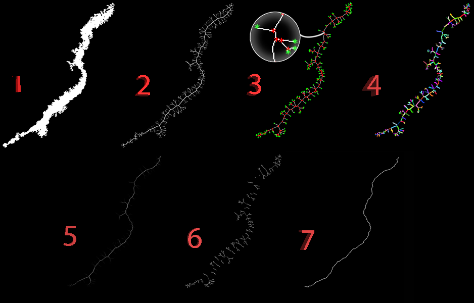

# Skeletonization Using Fuzzy Logic
### Mohammad Mahdi Kamani, Farshid Farhat, Stephen Wistar, James Z. Wang
In this repository you can see the code for skeletonization of binary images using our novel fuzzy inference system. Check out the demo notebook [here](https://github.com/mmkamani7/Skeletonization/blob/master/Skeletonization.ipynb)



Skeleton of a shape is a low-level representation that can be used for matching and recognition purposes in various fields of study including image retrieval and shape matching or human pose estimation and recovery. Skeleton can provide a good abstraction of a shape, which contains topological structure and its features. Because it is the simplest representation of a shape, there has been an extensive effort among researchers to develop generic algorithms for skeletonization of shapes. However, since there is no “true” skeleton defined for an object, the literature in skeletonization lack of a robust evaluation. The vast majority of the algorithms are based on Blum’s “Grassfire” analogy and formulation for skeletonization. The most important key factor in skeletonization algorithms is to preserve the topology of the shape. 


## Sofrware Requirements
This code has been developed and tested on Python2.7 on Windows, Ubuntu and MacOS, however, it shoud work fine on Python3.x. Please let us know if you have difficulty on running this code on Issues page. The code in Python needs some packages, you can get them by this line of code in bash or cmd (you might need sudo on Linux):

```bash
[sudo] pip install -U scipy scikit-image scikit-fuzzy
```


## Getting Started
You can see the demo in jupyter [here](https://github.com/mmkamani7/Skeletonization/blob/master/Skeletonization.ipynb). You can also use the functions directly as it is described in the notebook. Just add these lines at the begining of your code:

```python
from fuzzyTransform import fuzzyTransform
from skeleton2Graph import *
import skeletonization
```
to have the skeleton directly write the following lines:
```python
import skeletonization
ob = skeletonization.skeleton()
ob.BW = BW # the binary image that you want to find its skeleton
ob.skeletonization()
```
Then you would have an object with ``skeleton`` attribute which has the skeleton of your desired object.

You can also follow the steps described in the notebook:

After caculating the Euclidean Distance Transform and its gradient( as described in the notebook) you can call Flux function to calculate the outward flux:

```python
flux(delD_xn, delD_yn)
```
Then use this flux to calculate the graph of the initial skeleton and its information with this function:
```python
adjacencyMatrix, edgeList, edgeProperties,edgeProperties2, verticesProperties, verticesProperties2, endPoints, branchPoints = skeleton2Graph(initialSkeleton,initialSkeleton*fluxMap)
```
Then you would use our fuzzy inference system to prune the skeleton like this:
```python
skeletonNew = fuzzyTransform(initialSkeleton, vertices, edgeList, edgeProperties, verticesProperties, verticesProperties2, adjacencyMatrix)
```

## References 
```ref
@article{kamani2017skeleton,
  title={Skeleton Matching with Applications in Severe Weather Detection},
  author={Kamani, Mohammad Mahdi and Farhat, Farshid and Wistar, Stephen and Wang, James Z},
  journal={Applied Soft Computing},
  year={2017},
  publisher={Elsevier}
}
@inproceedings{kamani2016shape,
  title={Shape matching using skeleton context for automated bow echo detection},
  author={Kamani, Mohammad Mahdi and Farhat, Farshid and Wistar, Stephen and Wang, James Z},
  booktitle={Big Data (Big Data), 2016 IEEE International Conference on},
  pages={901--908},
  year={2016},
  organization={IEEE}
}
```
